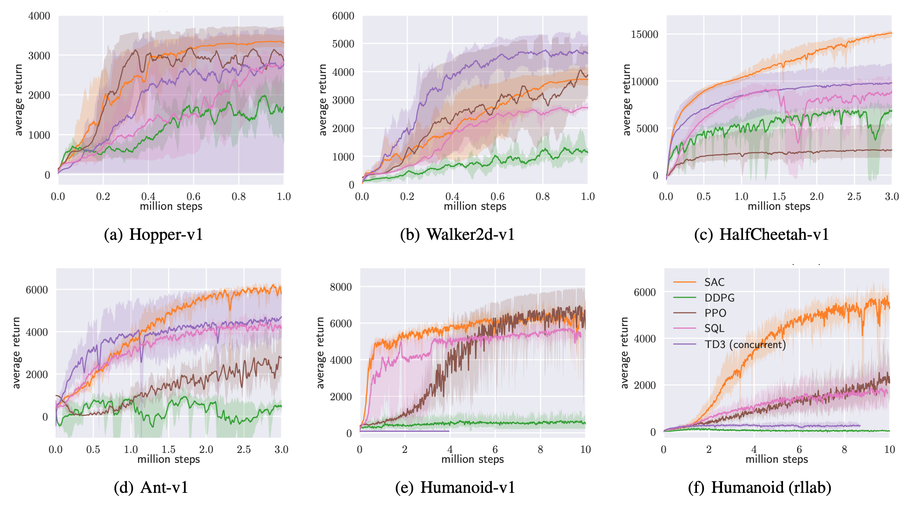
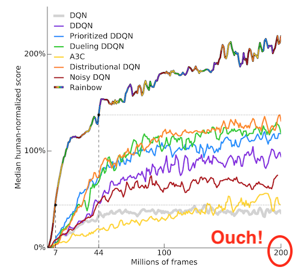
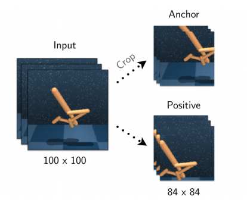

# CURL: Contrastive Unsupervised Representations for Reinforcement Learning

!!! tldr
    - Improves the sample efficiency when learning from pixels by using contrastive learning, a self-supervised method, as an auxiliary task. 
    - The contrastive objective works in a similar way as in SimCLR, using random cropping as an augmentation method.
    - After 100k interactions, outperforms all other methods on DM Control Suite, and shows strong results on Atari.  

    **April 2020 - [arXiv](https://arxiv.org/abs/2004.04136) - [Code](https://github.com/MishaLaskin/curl)**

Learning from pixels
---

In reinforcement learning, solving a task *from pixels* is much harder than solving an equivalent task using "physical" features such as coordinates and angles. This makes sense: you can consider an image as a high-dimensional vector containing hundreds of features, which don't have any clear connection with the goal of the environment!

As a result, you generally need a lot more interactions between an agent and its environment in order to learn a good policy from pixels. For example, the figure below shows the results of multiple recent RL methods on the DeepMind Control Suite, learning from physical features. Take a look at the x-axis: depending on the complexity of the task, the agents are trained from 1 to 10 million interactions: [^sac] 

On the other hand, let's have a look at results using Atari games as a benchmark. There is no notion of "physical" features with the Atari emulator: the only observations the agent can work with are RGB images. The agents now have to be trained for a staggering 200 million frames![^rainbow] Some distributed approaches even consider numbers up to a billion. 

This low sample-efficiency is clearly a problem. Not only does it mean the experiment turn-around time is excessive, it also means that there can be little hope of bringing such methods to the real world. Can you imagine having to collect a billion real-world interactions?

The paper we are considering takes a stab at this problem by bringing recent advances from vision and NLP to reinforcement learning. Contrastive learning takes advantage of data augmentation to learn more efficiently. CURL shows that it can be very useful in the context of RL to learn a good latent representation faster.

What is contrastive learning?
---

The core idea is to compare (contrast!) pairs of augmented samples. We consider two kinds of such pairs:

- **Positive pairs** consist of two different augmentations of the *same sample* 
- **Negative pairs** contain augmentations of two *different samples*

For each original sample, we create both positive and negative pairs. The contrastive representation is then learned by maximizing the agreement between positive pairs, and minimizing the agreement between negative pairs.

Contrastive learning has seen dramatic progress in recent years for language and vision. See for example BERT, an application to masked language modeling[^bert], or the SimCLR framework, used to learn visual representations[^simclr]. 

The way contrastive learning is implemented in CURL is mostly influenced by the SimCLR framework[^simclr], Momentum Contrast (MoCo)[^moco] and Contrastive Predictive Coding (CPC)[^cpc].

How CURL works
---

With CURL, the same latent representation is used for both the RL algorithm and the contrastive learning, as illustrated below: [^original]

CURL uses random crops to augment the observations. 
Since most RL methods use frame-stacking, each observation is effectively a "stack" of sequential images. CURL preserves their temporal structure by applying the same augmentation to each frame in the stack. 

The illustration below gives an example of a positive pair: the same observation is augmented in two different ways. The representation will be changed in a way that maximizes their agreement. [^original]

Evaluation
---

Using a contrastive objective as an auxiliary task appears to significantly improve the performance of the RL algorithm. 
CURL's performance is evaluated in two settings:

- with [SAC](sac.md) on DeepMind Control Suite (continuous control)
- with data-efficient [Rainbow DQN](rainbow.md) on Atari games (discrete control). 

In both cases, the performance is evaluated after 100k interactions, as the goal is to evaluate sample efficiency rather than asymptotic performance. 

Results are remarkable on DeepMind Control Suite : [^original]

(The last column, *State SAC*, uses physical states and is used as an "oracle" upper-bound.)

Results are very good on Atari games. This is again after 100k interactions: [^original]

How can this difference in performance be explained? One idea explored in the appendix is that in some environments, there is simply not enough information to fully recover the state when looking only at the pixel data: the problem then becomes **partially observable** and therefore much harder.  

Key concepts
---

"Building blocks" involved in this work:

- Focuses on [sample efficiency](sample-efficiency.md)
- Uses [contrastive learning](contrastive-learning.md)
- Uses [auxiliary tasks](auxiliary-tasks.md)
- Benchmarked on [DeepMind Control Suite](dm-control-suite.md)
- Benchmarked on [Atari games](atari.md)

Limitations
---

- :x: No comparison with [MuZero](muzero.md), which is SotA on multiple Atari games[^muzero-tweet]

Links
---

- [Official code repository](https://github.com/MishaLaskin/curl), a PyTorch implementation for SAC on DeepMind Control Suite
- [Official project page](https://mishalaskin.github.io/curl/), which provides a short summary of the paper
- [Twitter summary](https://twitter.com/Aravind7694/status/1248049713149906945) from first author

Authors
---

- Aravind Srinivas [Twitter](https://twitter.com/Aravind7694)/[Scholar](https://scholar.google.com/citations?user=GhrKC1gAAAAJ)/[Academic](https://people.eecs.berkeley.edu/~aravind/)
- Michael Laskin [Twitter](https://twitter.com/MishaLaskin)/[Scholar](https://scholar.google.com/citations?user=DOGDnwsAAAAJ)/[Academic](https://mishalaskin.github.io/)
- Pieter Abbeel  [Twitter](https://twitter.com/pabbeel)/[Scholar](https://scholar.google.com/citations?user=vtwH6GkAAAAJ)/[Academic](https://people.eecs.berkeley.edu/~pabbeel/)

[^sac]: [Soft Actor-Critic: Off-Policy Maximum Entropy Deep Reinforcement Learning with a Stochastic Actor](https://arxiv.org/abs/1801.01290)
[^rainbow]: [Rainbow: Combining Improvements in Deep Reinforcement Learning](https://arxiv.org/abs/1710.02298)
[^bert]: [BERT: Pre-training of Deep Bidirectional Transformers for Language Understanding](https://arxiv.org/abs/1810.04805)
[^simclr]: [A Simple Framework for Contrastive Learning of Visual Representations](https://arxiv.org/abs/2002.05709) (SimCLR)
[^moco]: [Momentum Contrast for Unsupervised Visual Representation Learning](https://arxiv.org/abs/1911.05722) (MoCo)
[^cpc]: [Data-Efficient Image Recognition with Contrastive Predictive Coding](https://arxiv.org/abs/1905.09272) (CPC)
[^original]: excerpts from original paper
[^muzero-tweet]: [https://twitter.com/gwern/status/1248087160391163906](https://twitter.com/gwern/status/1248087160391163906)
