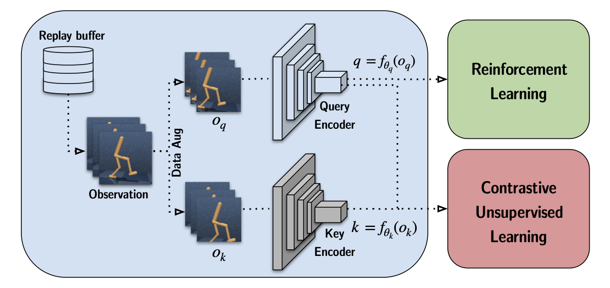
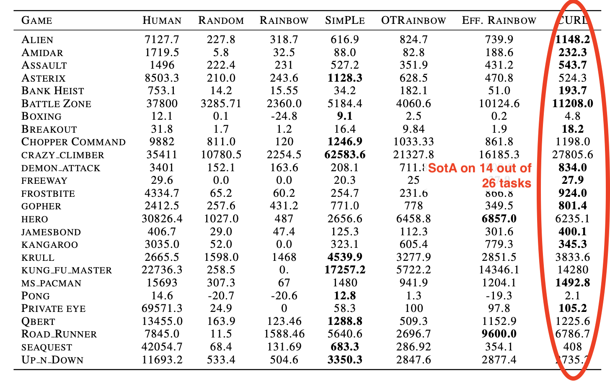

# CURL: Contrastive Unsupervised Representations for Reinforcement Learning

!!! tldr
    CURL improves the sample efficiency of model-free RL methods when learning from pixels by using a **contrastive objective** as an auxiliary task. 
    After 100k interactions, it outperforms all other methods on DM Control Suite and shows strong results on Atari games.  

    **April 2020 - [arXiv](https://arxiv.org/abs/2004.04136) - [Code](https://github.com/MishaLaskin/curl)**
    
    
### Paper summary
CURL improves the sample efficiency when learning from pixels by using contrastive learning, a self-supervised method, as an auxiliary task. 
This method can be combined with any model-free RL algorithm. 

#### What is contrastive learning?
The core idea is to compare (contrast!) pairs of augmented samples. There are two kinds of such pairs:

- **Positive pairs** consist of two different augmentations of the *same sample* 
- **Negative pairs** contain augmentations of two *different samples*

The contrastive representation is then learned by maximizing the agreement between positive pairs, and minimizing the agreement between negative pairs

Contrastive learning has seen dramatic progress in recent years for language and vision - see for example BERT which is an application to masked language modeling[^bert], or the SimCLR framework used to learn visual representations[^simclr]. 

The way contrastive learning is implemented in CURL is mostly influenced by the SimCLR framework[^simclr], Momentum Contrast (MoCo)[^moco] and Contrastive Predictive Coding (CPC)[^cpc].

#### How CURL works
With CURL, the same latent representation is used for both the RL algorithm and the contrastive learning, as illustrated below: [^paper-screenshot]

CURL exclusively uses random crops to augment the observations. 
Since most RL methods use frame-stacking, each observation is effectively a "stack" of sequential images. CURL preserves their temporal structure by applying the same augmentation to each frame in the stack. 

The illustration below gives an example of a positive pair: the same observation is augmented in two different ways. The representation will be changed in a way that maximizes their agreement. [^paper-screenshot]

#### Evaluation
Using a contrastive objective as an auxiliary task significantly improves the performance of the underlying RL algorithm. 
The performance is evaluated in two settings:

- with [SAC](sac.md) on DeepMind Control Suite (continuous control)
- with data-efficient [Rainbow DQN](rainbow.md) on Atari games (discrete control). 

In both cases, the performance is evaluated after 100k iterations, as the goal is to evaluate sample efficiency rather than asymptotic performance. 

Results are remarkable on DeepMind Control Suite : [^paper-screenshot]

(The last column, *State SAC*, uses physical states and is used as an "oracle" upper-bound.)

Results are very good on Atari games: [^paper-screenshot]

### Key concepts
"Building blocks" involved in this work:

- Focuses on [sample efficiency](sample-efficiency.md)
- Uses [contrastive learning](contrastive-learning.md)
- Uses [auxiliary tasks](auxiliary-tasks.md)
- Benchmarked on [DeepMind Control Suite](dm-control-suite.md)
- Benchmarked on [Atari games](atari.md)

### Limitations
- ❌ No comparison with [MuZero](muzero.md), which is SotA on multiple Atari games[^muzero-tweet]

### Authors
- Aravind Srinivas [Twitter](https://twitter.com/Aravind7694)/[Scholar](https://scholar.google.com/citations?user=GhrKC1gAAAAJ)/[Academic](https://people.eecs.berkeley.edu/~aravind/)
- Michael Laskin [Twitter](https://twitter.com/MishaLaskin)/[Scholar](https://scholar.google.com/citations?user=DOGDnwsAAAAJ)/[Academic](https://mishalaskin.github.io/)
- Pieter Abbeel  [Twitter](https://twitter.com/pabbeel)/[Scholar](https://scholar.google.com/citations?user=vtwH6GkAAAAJ)/[Academic](https://people.eecs.berkeley.edu/~pabbeel/)

### Links

- [Official code repository](https://github.com/MishaLaskin/curl), a PyTorch implementation for SAC
- [Official project page](https://mishalaskin.github.io/curl/), a good short summary of the paper
- [Twitter summary](https://twitter.com/Aravind7694/status/1248049713149906945) from first author

[^bert]: [BERT: Pre-training of Deep Bidirectional Transformers for Language Understanding](https://arxiv.org/abs/1810.04805)
[^simclr]: [A Simple Framework for Contrastive Learning of Visual Representations](https://arxiv.org/abs/2002.05709) (SimCLR)
[^moco]: [Momentum Contrast for Unsupervised Visual Representation Learning](https://arxiv.org/abs/1911.05722) (MoCo)
[^cpc]: [Data-Efficient Image Recognition with Contrastive Predictive Coding](https://arxiv.org/abs/1905.09272) (CPC)
[^paper-screenshot]: excerpts from original paper
[^muzero-tweet]: [https://twitter.com/gwern/status/1248087160391163906](https://twitter.com/gwern/status/1248087160391163906)
