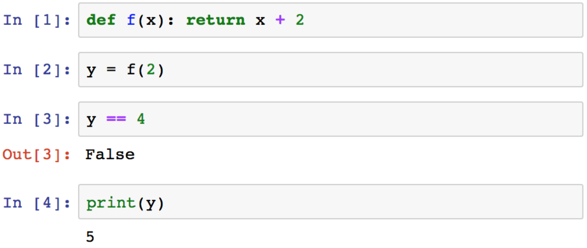

# Notebook Pitfalls

!!! hint
    This concept is not directly related to reinforcement learning, however, it is still relevant to RL researchers! 

Notebooks are great for running quick experiments and exploratory data analysis. However, they come with a number of pitfalls users need to be aware of.

Not suitable for long-running tasks
---

- Can't run anything else while a cell is running
- If you wait, then your workflow is dictating when you can code and when you need to take a break. You should be the master of your workflow, and not let the workflow dictate what you can do!
- If you don't wait, you can either change code while the task is running, which is risky: if the task fail, it'll be hard to debug
- Or you can duplicate the notebook, but then you end up with multiple "branches" that you'll have to merge at some point. 
- Problems with disconnections! https://github.com/jupyterlab/jupyterlab/issues/2833, https://github.com/jupyter/notebook/issues/1150

        Well the simple fact that you can only run a single cell at a time means that as long as your notebook is running, you can't do anything else. Or you need duplicate your notebook, and then end up with multiple parallel versions.
        
        There's also the fact that if you get disconnected from the Jupyter server you're screwed. Colab timeout? screwed. Close your laptop or lose connectivity? screwed.
        
        For long running tasks you should really commit your code, start it in background or on another machine with results pushed to TB or W&B, then keep working on your code running only short tests.
        
        See eg these recommendations from OpenAI:
        
        Your ideal experiment turnaround-time at the debug stage is <5 minutes
        
        And to me 5 minutes is already a high upper bound! Your workflow should allow you to run anything longer than a couple minutes in the background in a "fire and forget" way, otherwise you're just wasting your time in unnecessary context switches.
        
        Also note that you don't necessarily need to extract your notebook code into a python file to run it in the background! You can just run it using something like nbconvert (the way Kaggle runs a kernel in the background when you commit it).

Error-prone execution flow
---

The first pitfall is the way code gets executed in notebooks: the execution of each cell alters the global state. 
There is no warranty that cells are ran in order, which can result in confusing situations if you don't keep track of cell history.

In the example above[^grus], the final results seems surprising. 
What happened is that a change was done to the global state between the first and second cell, in a cell that has since been deleted. 
This problem often happens with module imports or function definitions: it is easy to accidentally delete a cell that doesn't look useful anymore, only to realize later that its content was indeed needed. 
Since the side effect of that cell kept effect until the runtime was restarted, the problem can be overlooked for some time.

A solution, that will come back repeateadly in this article, is to **run "Restart Runtime and Run All" aggressively**.
This is your best weapon against hidden states.

The example above[^grus] appears even nastier at first look, but is less common in practice.
Here, what happened is that the content of some cells was modified after being executed, which perhaps surprisingly is not visible from the notebook UI.

One use case where this can happen is if you start a long running task, then start editing other parts of the code.
It can quickly become confusing to remember which parts of your code where changed before and after the start of that task, which can make debugging difficult if said task doesn't complete as expected.

A solution is to **commit your notebook often**, ideally every time before you start a long-running task. This ensures that you have a snapshot of the state of your notebook when the task started.

Poor code assist
---

Modern IDEs, such as IntelliJ, have amazing auto-complete capabilities. Modern IDEs not only suggest completions as you type, but they will also perform type checking and other form of sanity checks that can save previous time.

In contrast, autocomplete in notebooks is still terribly lackluster: [^grus]

Notebooks don't take advantage of type information: [^grus]

At this point, IDEs and notebooks provide two different approaches to improve iteration time:

- IDEs: top-notch autocomplete helps writing code faster and more confidently
- Notebooks: instant execution of each piece of code helps you check that things work as expected  

Could they be combined? I do think so. Modern Javascript engines are good enough to run the advanced heuristics Eclipse or IntelliJ uses under the hood. 
It's hopefully only a matter of time before such approaches are implemented.

Beyond autocompletion and type checking, IDEs offer two other invaluable tools:

- Linting: IDEs will clean up entire files to conform to PEP8 at the push of a button
- Refactoring: IDEs can perform advanced refactors, looking through multiple files

Both of these make it easier to keep your code clean and readable.

"I don't like notebooks"
---

The last two points are inspired by a 2018 talk by [Joel Grus](https://joelgrus.com/), a veteran Python developer and author, who works on machine learning at the [Allen Institute](http://allenai.org/). If you have the time, I recommend you watch the full video:

The slide deck is also available [on Google Doc](https://docs.google.com/presentation/d/1n2RlMdmv1p25Xy5thJUhkKGvjtV-dkAIsUXP-AL4ffI/preview?slide=id.g362da58057_0_1).

Joel raises a few other interesting points, such as how notebooks hinder modularity and testability, and various usability problems.

[^grus]: [I don't like notebooks.- Joel Grus (Allen Institute for Artificial Intelligence)](https://www.youtube.com/watch?v=7jiPeIFXb6U)